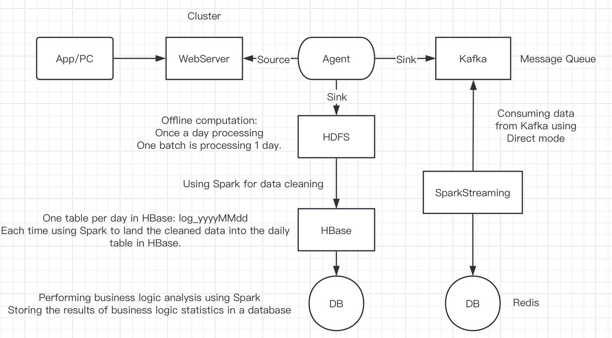

# Spark_Project

This project employs Spark for both offline and real-time analysis of website data.

### 1. Framework

Spark, Hadoop (HDFS + YARN), Zookeeper, HBase, Kafka, Redis

### 2. Languages

Scala, Java

### 3. WorkFlow

#### 3.1 Offline Processing (Spark, Hadoop, Zookeeper, HBase)

Extract, Transform, Load (ETL) process using Spark to process website user behavior logs stored in HDFS. Stored Processed data in HBase.
Two optimizations applied to HBase:
- Disable Write-Ahead Logging (WAL)
- Utilize Bulkload for enhanced performance.

Analyze and aggregate log data stored in HBase using Spark, and store the results in MySQL:
- Regional distribution analysis
- Client access distribution analysis

#### 3.2 Real-time Processing (Spark, Hadoop, Zookeeper, Kafka, Redis)

Utilize Spark Streaming and Redis integration for real-time analysis of order data

Data ingestion via Kafka
- Real-time calculation of daily total orders
- Real-time calculation of daily total order amounts

Results are stored in Redis

### 4. Environment Parameters:

| Name       | Version | Port | Web-interface port |
|------------|---------|------|--------------------|
| Hadoop     | 3.3.6   | 9000 | 9870               |
| Zookeeper  | 3.9.2   | 2181 |                    |
| HBase      | 2.5.8   | 2181 | 16010/16030        |
| Spark      | 2.4.2   | 8088 |                    |
| Redis      | 7.2.4   | 6379 |                    |
| MySQL      | 8.3.0   | 3306 |                    |

Refer to this article for Hadoop installation instructions： 
https://medium.com/@MinatoNamikaze02/installing-hadoop-on-macos-m1-m2-2023-d963abeab38e

### 5. Code for Spark on Yarn Mode
Code for Spark submit:  
$SPARK_HOME/bin/spark-submit \
--class batch.LogApp \
--master yarn \
--name LogApp \
--conf "spark.serializer=org.apache.spark.serializer.KryoSerializer" \
--jars $(echo $HBASE_HOME/lib/*.jar | tr ' ' ',') \
/home/hadoop/lib/spark.jar \
20190130

### 6. Code used in MySQL:
create database spark; \
use spark;  \
create table if not exists browser_stat (  \
day varchar(10) not null,  \
browser varchar(100) not null,  \
cnt int  \
) engine=innodb default charset=utf8;  